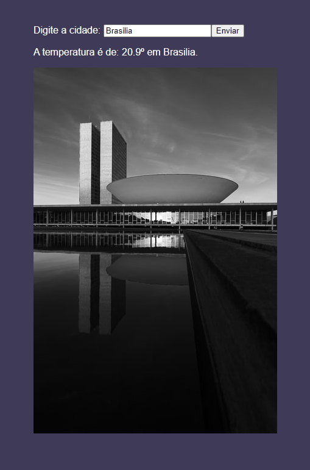

# WaetherAPI

<h4 align="center"> 
	🚧  Complete  🚧
</h4>

<h3>Online here: https://weatherapi-gui.web.app/ </h3>

Table of Contents
=================
<!--ts-->
   * [About project](#About-Project)
   * [Technologies](#-Technologies)
   * [Features](#Features)
   * [Preview of Project](#Preview-of-Project)
   * [Author](#Author)
<!--te-->

## About project
  
Here i made a project for study using API call.  Here I have an input where the user can type some city. The system call weather and a image of this city and print in screen.  Both calls are from different APIs.
  
In this project i used:
* [Create React App](https://github.com/facebook/create-react-app) to start the project.
* [Open Weather](https://openweathermap.org/) to take weather infos.
* [Unsplash](https://unsplash.com/) API to take a image show off in the request.

## 🛠 Technologies

The following tools were used in the construction of the project:

- [React](https://pt-br.reactjs.org/)
- [Styled Components](https://styled-components.com/)
- [Axios](https://axios-http.com/)

### Features

- [x] Call in Weather API
- [x] Call in images API

 ##  Preview of Project

  

 ##  Note
 
 The free plan of [Open Weather]() dont allow to make requests online, so if you want get the full aplication seen the weather info you have to clone this repository and start it with "npm start" in the comand line to open in locallhost.

### Author
---
Made by Guilherme Cabral 👋🏽 Contact me!

 

